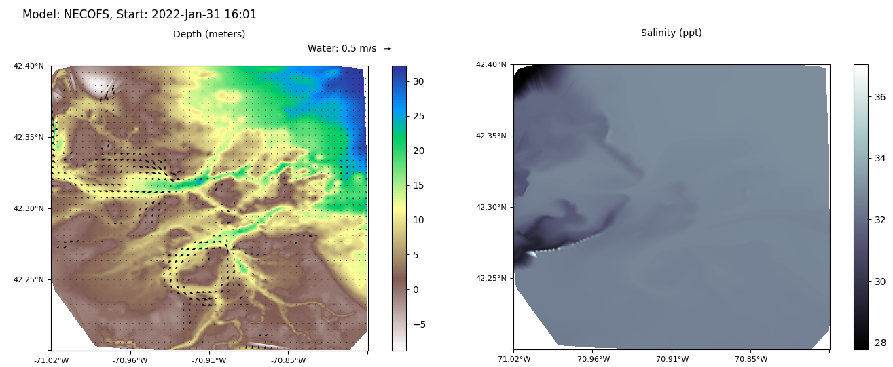
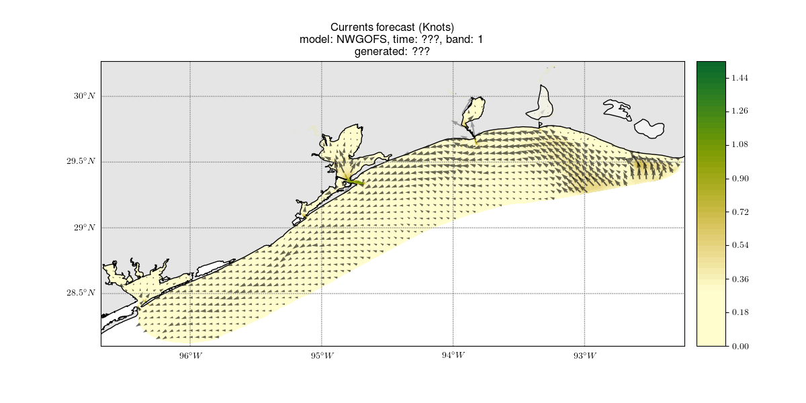

# Whelk
### Accessing coastal water surface data and converting to raster
----

Numerous sources provide access to coastal data such as forecasts of wind, water currents, and salinity. These are typically available in [NetCDF](https://www.unidata.ucar.edu/software/netcdf/) format, accessed through [THREDDS Data Server](https://www.unidata.ucar.edu/software/tds/current/). The data may come in various forms such as regular grids that can be readily saved as local GeoTIFF rasters or TINs that require interpolation. 

This repo contains utilities for accessing online water surface data and converting that data to GeoTIFF rasters. In cases where the data provides a vertical axis through the water column, only the top water surface is selected. However, when the data has an axis for forecasts over time, each is saved as a band in a multi-band raster. For example, I can request water velocities for Boston Harbor from [NECOFS](http://fvcom.smast.umassd.edu/necofs/) for three hours from August 20, 2020; the output will be two (u and v components) multi-band rasters where each band is one hour. Only water surface data is supported since the original purpose of this repo is to provide time-indexed forecasts to support autonomous surface vehicle planning.

When the option is selected, the utilities produce plots as well as rasters, which make it easier to quickly visualize the content of multi-band rasters. A figure is produced for every discrete time band, so it may produce a great number of figures. 

I learned how to work with NetCDF data from a [Jupyter notebook by Rich Signell](http://rsignell-usgs.github.io/blog/blog/2014/01/08/fvcom/).
Some of the code for accessing variables and plotting are directly lifted. 

## Data sources

The repo is organized with a folder per data source, with scripts inside for accessing data from that source. 

#### [The Northeast Coastal Ocean Forecast System (NECOFS)](http://fvcom.smast.umassd.edu/necofs/)

[Directory](NECOFS/)

**Data extracted**

- Height (height, width) - meters
- Water current u component (height, width, hour) - meters/second
- Water current v component (height, width, hour) - meters/second
- Salinity (height, width, hour) - parts per thousand

**Example**

        --bounds -70.97,-70.82,42.25,42.35 \

    # Get Boston Harbor forecasts from right now to the next two hours
    python3 NECOFS/necofs2raster.py \
        --nc http://www.smast.umassd.edu:8080/thredds/dodsC/FVCOM/NECOFS/Forecasts/NECOFS_FVCOM_OCEAN_MASSBAY_FORECAST.nc \
        --bounds -71.0192787,-70.8513873,42.2495029,42.4008038 \
        --rows 1134 \
        --cols 1259 \
        --times 2 \
        --geotiff_prefix NECOFS/sample_output/sample \
        --plot NECOFS/sample_output/sample.png

Sample output:

    http://www.smast.umassd.edu:8080/thredds/dodsC/FVCOM/NECOFS/Forecasts/NECOFS_FVCOM_OCEAN_MASSBAY_FORECAST.nc
    NetCDF: NECOFS Massachusetts (FVCOM) - Massachusetts Coastal - Latest Forecast
    ------------------
    URL: http://www.smast.umassd.edu:8080/thredds/dodsC/FVCOM/NECOFS/Forecasts/NECOFS_FVCOM_OCEAN_MASSBAY_FORECAST.nc
    Duration: 2022-01-27 00:00:00 ---- 2022-02-02 00:00:00
    Keys:
    odict_keys(['x', 'y', 'lon', 'lat', 'xc', 'yc', 'lonc', 'latc', 'siglay',
    'h', 'nv', 'time', 'Times', 'zeta', 'nbe', 'aw0', 'awx', 'awy', 'u', 'v'
    'ww', 'ua', 'va', 'temp', 'salinity', 'fvcom_mesh'])

    Output rasters:
    Rows: 1134, columns: 1259, bands: 2 
    Desired start time: 2022-01-31 14:52:24.371606)
    Desired number of hourly bands: 2
    Forecast band times:
        [0] 2022-Jan-31 15:00
            [1] 2022-Jan-31 16:0

Plot of first hour:

**Options**

    Usage: necofs2raster.py [options]

    Options:
      -h, --help            show this help message and exit
      -n NC, --nc=NC        Path to NECOFS NetCDF.
      -s START, --start=START
                            Desired time of first forecast. If not set, use
                            current time. Format: Y:M:D:H:M:S
      -v, --verbose         Print verbose NetCDF metadata.
      -i, --info            Print NetCDF information and exit.
      -b BOUNDS, --bounds=BOUNDS
                            Comma-delimited spatial bounds for region raster i.e.
                            'lon_min,lon_max,lat_min,lat_max'
      -r ROWS, --rows=ROWS  Number of rows of target raster
      -c COLS, --cols=COLS  Number of columns of target raster
      -t TIMES, --times=TIMES
                            Number of sequential forecast hours where each is a
                            raster band.
      -g GEOTIFF_PREFIX, --geotiff_prefix=GEOTIFF_PREFIX
                            Prefix of file paths to store output rasters
      -p PLOT, --plot=PLOT  File path to save plot.

#### [Northern Gulf of Mexico Operational Forecast System (NGOFS)](https://tidesandcurrents.noaa.gov/ofs/ngofs/ngofs.html)

**WORK IN PROGRES --- JUST A HARD CODED DEMO!!!!**

**Data extracted**

- Water current u component (height, width, hour) - meters/second
- Water current v component (height, width, hour) - meters/second
- Salinity (height, width, hour) - practical salinity units
- Potential temperature (height, width, hour) - celsius 

**Example**

COMING SOON! This has three separate scripts, but all are hard-coded!

**Options**

None since hard-coded: will fix soon. 

